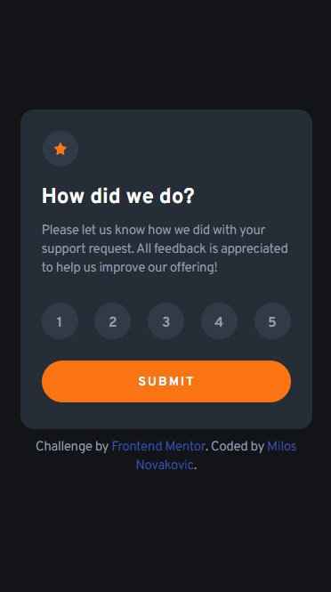
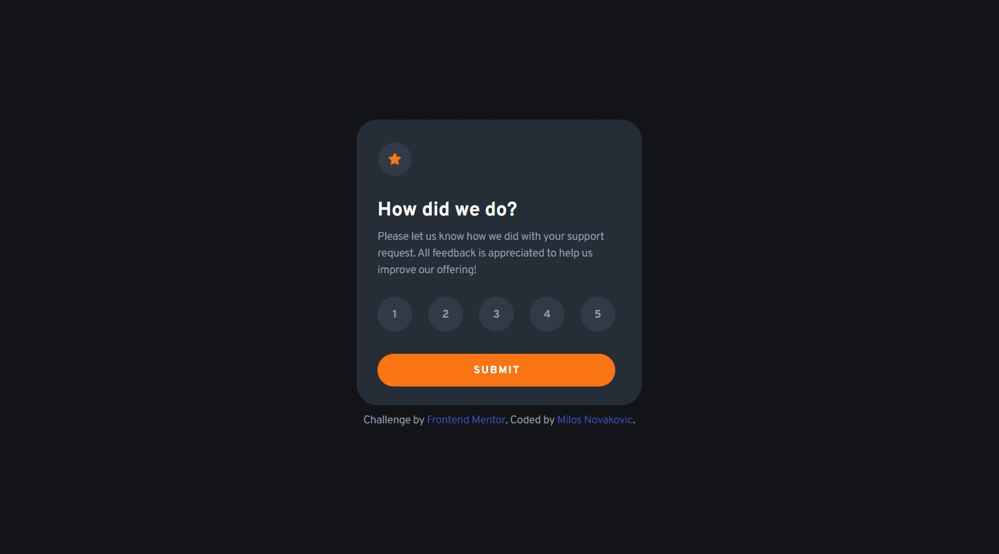
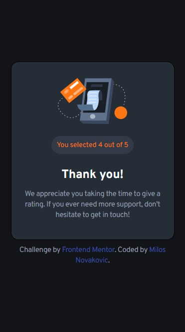

# Frontend Mentor - Interactive rating component solution

This is a solution to the [Interactive rating component challenge on Frontend Mentor](https://www.frontendmentor.io/challenges/interactive-rating-component-koxpeBUmI). Frontend Mentor challenges help you improve your coding skills by building realistic projects. 

## Table of contents

- [Overview](#overview)
  - [The challenge](#the-challenge)
  - [Screenshot](#screenshot)
  - [Links](#links)
- [My process](#my-process)
  - [Built with](#built-with)
  - [What I learned](#what-i-learned)
  - [Continued development](#continued-development)
  - [Useful resources](#useful-resources)
- [Author](#author)

## Overview

### The challenge

Users should be able to:

- View the optimal layout for the app depending on their device's screen size
- See hover states for all interactive elements on the page
- Select and submit a number rating
- See the "Thank you" card state after submitting a rating

### Screenshot
<div>
    
    
    
    
</div>

### Links

- Solution URL: [My solution URL](https://github.com/MiloosN5/InteractiveRatingComponent_Challenge)
- Live Site URL: [My live site URL](https://miloosn5.github.io/InteractiveRatingComponent_Challenge/public/)


## My process

### Built with

- Semantic HTML5 markup
- SASS - compiled into the CSS
- BEM
- Flexbox
- Mobile-first workflow
- REM (Root EM) & EM (for Responsive)
- Responsive layout
- [JavaScript](https://www.javascript.com/) - JavaScript

### What I learned

* When making web pages, it's important to take care about all possible users. Since there are so many different devices, website should be responsive. It includes things like different widths and font-size. Since we don't know how arrow device can it be, word-wrap: break-word; was used to secure that the word will be splitted into the multiple lines if it's wider than the width of the parent container. 
* To get the feedback depending on the rate we choose, we need to make interaction between rate numbers, submit button and message that gonna be outputed later. For that purpose, the work can be done using JavaScript. We need DOM (Document Object Model) in order to access elements that we need. With the help of .forEach() method, we can iterate over possible rate numbers and add addEventListener method with 'click' type that will be triggered when we click one of these numbers. Eventually, we can interpolate choosen value with the message that we want to output. It can be done using 'Template literals'. Value that will be interpolated is the context of the choosen number (ex. &lt;span&gt;5&lt;/span&gt; => 5 is context of this element)
* When the submittion is done, we need to toggle between first layout (rating) and second layout (feedback). It is done using add/remove class for different displaying (none/flex) when clicking 'submit' button (using addEventListener).


  * toggle hide/show
  ```js
    let submitButton = document.querySelector('.rating__submit');
    let ratingSection = document.querySelector('.rating');
    let feedbackSection = document.querySelector('.feedback');

    submitButton.addEventListener('click', () => {
        feedbackSection.classList.add('displayOn');
        feedbackSection.classList.remove('displayOff');
        ratingSection.classList.add('displayOff');
        ratingSection.classList.remove('displayOn');
    })
  ```
  * feedback
  ```js
    let rateWrapper = document.querySelector('.rating__rate');
    const rateNumbers = Array.from(rateWrapper.querySelectorAll('div span'));
    let displayMessage = document.querySelector('.feedback__youSelected span');

    rateNumbers.forEach((number) => {
        number.addEventListener('click', (event) => {
            const thisNumber = event.target;
            const allOtherNumbers = rateNumbers.filter(number => {
                return (number !== thisNumber);
            });
            allOtherNumbers.forEach(number => {
                number.classList.remove('activeRate');
                number.classList.add('defaultRate');
            });
            thisNumber.classList.add('activeRate');
            thisNumber.classList.remove('defaultRate');
            displayMessage.innerHTML = `You selected ${event.target.innerHTML} out of 5`;
        })
    })
  ```

### Continued development

Testing different addEventLister event types.

### Useful resources

- [Target rate](https://stackoverflow.com/questions/67576284/pick-only-one-item) - Toggle between choosen rate numbers - pick only one at the time.
- [Template literals](https://developer.mozilla.org/en-US/docs/Web/JavaScript/Reference/Template_literals) - String interpolation using backticks (``).
- [addEventListener](https://developer.mozilla.org/en-US/docs/Web/API/EventTarget/addEventListener) - EventTarget.addEventListener() method for different event types (click, change, input ...).

## Author

- GitHub - [MiloosN5](https://github.com/MiloosN5)
- Frontend Mentor - [@MiloosN5](https://www.frontendmentor.io/profile/MiloosN5)


